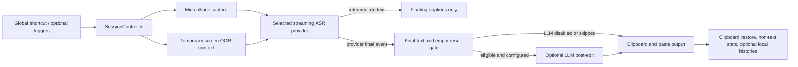

# VoxType Architecture

This is the English-first contributor map. The detailed Chinese maintenance view lives in [`docs/architecture.md`](docs/architecture.md), and ASR quality or latency changes must also follow [`docs/asr-quality-latency-guardrails.md`](docs/asr-quality-latency-guardrails.md).

## Runtime Flow

Intermediate ASR text is feedback only. It must never enter LLM polishing, output, recent context, automatic-hotword history, or successful usage statistics. Doubao output waits for its final package; Alibaba Cloud output waits for `task-finished`. An empty final result is a failure.

## Ownership Map

| Area | Primary files | Responsibility |
| --- | --- | --- |
| UI composition | `src/lib/components/`, `src/lib/app/` | Svelte views and focused state controllers |
| Native command boundary | `src-tauri/src/commands/`, `src-tauri/src/lib.rs` | Tauri command registration and UI/native data transfer |
| Session state | `src-tauri/src/session.rs` | Recording phases, generation guards, start/stop orchestration |
| Audio | `src-tauri/src/audio.rs` | Device selection, PCM normalization, ASR-sized packet buffering |
| ASR routing | `src-tauri/src/asr_provider.rs` | Provider selection and provider-specific readiness gates |
| Doubao ASR | `src-tauri/src/asr.rs`, `src-tauri/src/asr_ws/` | Request context, WebSocket lifecycle, caption updates, final-text selection |
| Alibaba ASR | `src-tauri/src/aliyun_asr.rs` | FunASR task protocol, live captions, final event gate |
| Optional LLM | `src-tauri/src/llm_post_edit.rs`, `llm_client.rs`, `llm_request_adapter.rs` | Eligibility, prompt boundaries, provider adaptation, response handling |
| Text output | `src-tauri/src/text_output.rs` | Clipboard snapshot/write/readback, paste simulation, restore attempt |
| Privacy and diagnostics | `src-tauri/src/app_log.rs`, `commands/diagnostic_commands.rs` | Redaction, bounded logs, non-sensitive diagnostics |
| Local data | `src-tauri/src/stats.rs`, `config.rs`, `hotword_history.rs` | Non-text stats and explicitly enabled local text histories |
| Windows integration | `hotkey.rs`, `tray.rs`, `overlay.rs`, `system_audio.rs`, `autostart.rs` | Input hooks, tray, captions, audio state, startup registration |
| Release/update | `update.rs`, `scripts/ai-release-check.ps1`, `.github/workflows/` | Update checks, release validation, CI and security automation |

## State and Failure Boundaries

Each recording owns a monotonically changing `generation`. Late workers from an older recording cannot overwrite the new session. Processing phases block accidental parallel starts, and failures restore system state before reporting a stable error code to the UI.

The output boundary is intentionally strict:

1. A provider final event must exist.
2. The selected final text must be non-empty.
3. LLM editing runs only when enabled, above `min_chars`, and fully configured.
4. Clipboard write/readback must succeed before simulated paste.
5. A successful paste may still carry a non-fatal warning if the previous clipboard cannot be completely restored.

## Trust and Privacy Boundaries

- Microphone audio leaves the device only for the selected ASR provider; it is not written to the normal application log or usage statistics.
- Optional LLM editing sends the final text and only the reference context the user explicitly enabled.
- Screen OCR context is temporary for the current request and must not be persisted or logged as text.
- Usage statistics contain duration, character count, speed, and timestamps—not transcript text.
- Recent context and automatic-hotword history are local, separate files and are disabled by default.
- Logs and diagnostic reports redact common secret shapes and the current Windows user-profile path. They must still avoid receiving transcript, prompt, hotword, or OCR bodies in the first place.
- The in-app updater currently trusts assets published by the configured GitHub repository. Artifact signing and provenance require a separate security design; see [ROADMAP.md](ROADMAP.md).

## Change Guide

- ASR final text, packet timing, OCR waits, or tail handling: read the ASR guardrails and add provider-specific regression tests.
- Configuration fields: update Rust defaults/validation, `config.example.toml`, settings UI, all three UI languages, README files, and Wiki drafts together.
- User-visible behavior: update both README files and the matching Wiki draft.
- Logs, diagnostics, local histories, screenshots, or release files: run the checked-in secret scanner and document the privacy impact.
- UI: preserve controller/component boundaries and verify the real Tauri window when behavior changes.

Start with [CONTRIBUTING.md](CONTRIBUTING.md), use `npm run ai:check` for ordinary work, and use `npm run ai:release-check` before publishing.

## Maintenance

- [English maintenance guide](docs/maintenance-guide.en.md)
- [中文维护指南](docs/maintenance-guide.md)
