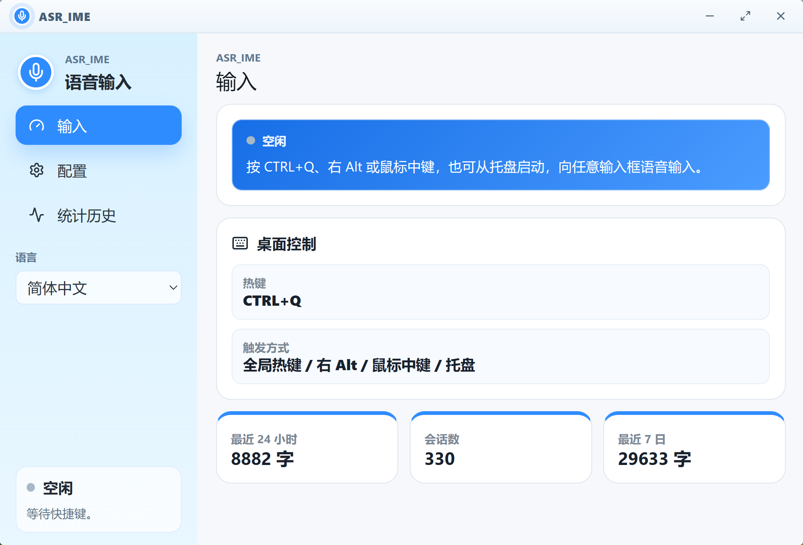
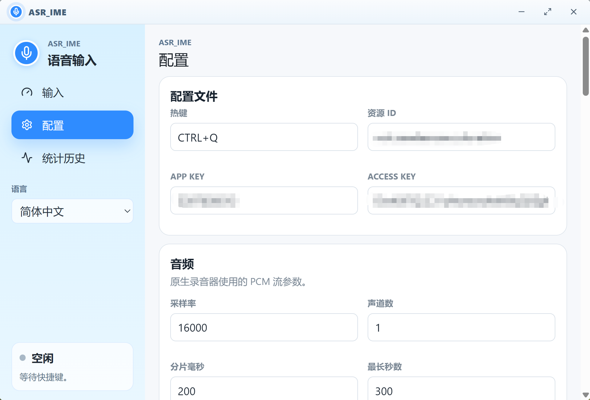
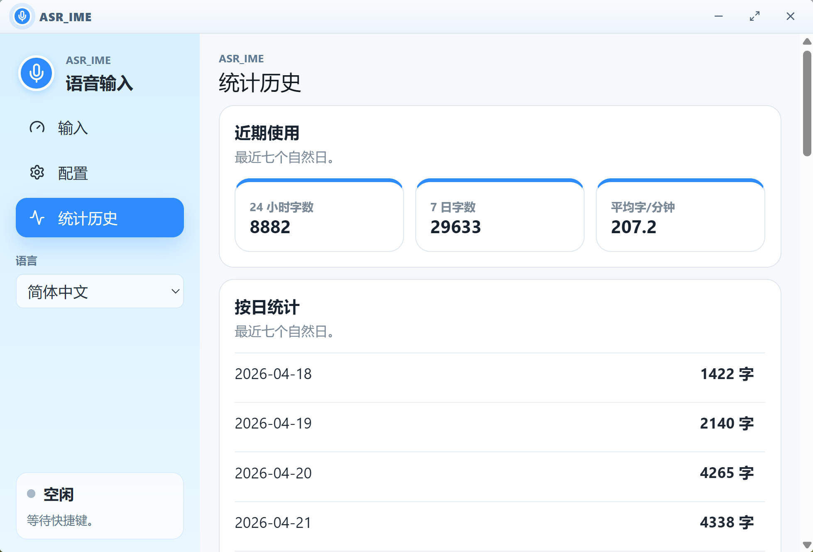

# 声写 VoxType

声写（VoxType）是一个 Windows 桌面语音输入工具。把光标放到任意输入框后，按下全局热键开始说话，程序会录制麦克风音频，通过豆包流式 ASR WebSocket 识别语音，并将最终文本写入剪贴板后粘贴到当前输入位置。

当前代码已迁移为根目录 Tauri 项目：Rust 负责全局热键、输入钩子、音频采集、ASR 会话、剪贴板、系统托盘、悬浮字幕窗和系统音量；Svelte 负责主窗口 GUI。

> 这是个人项目，目标是实用、轻量、易修改。请勿把真实密钥、个人热词、上下文或本地日志提交到仓库。

## 界面预览

主界面采用蓝白配色和紧凑侧边栏，常用状态、触发方式和最近统计集中在首页。



配置页直接以文本表单展示本地配置项，便于个人项目快速修改和排查。



统计页展示最近 24 小时、最近 7 日和按日使用情况，新识别结果写入后会刷新。



录音过程中会在当前屏幕居下显示悬浮字幕，用于实时查看转写内容。


## 功能

- 全局触发：默认只启用 `Ctrl + Q`；右 Alt 和鼠标中键可在配置页手动开启，避免误触或与其他软件冲突。
- 麦克风采集：使用 Rust `cpal` 采集 PCM 音频，可选择输入设备。
- 流式识别：对接豆包 `bigmodel_async` WebSocket，支持实时片段和最终结果。
- 悬浮字幕：录音时在屏幕居下显示实时识别文本，不抢焦点。
- 自动输入：最终文本写入剪贴板，并用带扫描码和短间隔的 `Ctrl+V` 或 `Shift+Insert` 粘贴到当前焦点输入框；默认自动粘贴后恢复原剪贴板文本。
- 可选润色：可调用 OpenAI 兼容接口做轻度后处理；配置页可直接测试豆包 ASR 和大模型 Key 是否可用。
- 系统音量：可配置录音期间临时静音系统音量，结束后恢复；默认关闭，避免影响会议、视频或系统提示音。
- 托盘常驻：关闭主窗口时隐藏到托盘，可从托盘打开配置和日志；只有托盘菜单“退出”才正式退出。
- 开机启动：可在配置页开启随 Windows 登录自动启动。
- 检查更新：可通过 GitHub Release 检查最新版，并下载启动 Windows 安装包。
- 诊断日志：配置页和托盘均可打开本地日志，便于排查识别、粘贴、网络和更新问题。
- 配置健康检查：首页显示 ASR 密钥、麦克风、粘贴方式、触发方式和隐私设置状态，帮助新用户快速知道还差哪一步。
- 多语言界面：简体中文、繁体中文、英语，默认简体中文。

## 环境

仅面向 Windows 10/11。

普通用户请下载并运行 `VoxType-*-setup.exe` 安装包。安装包会内置 Microsoft Edge WebView2 Bootstrapper，在系统缺少 WebView2 Runtime 时自动安装运行时。

项目不再发布绿色版 ZIP。绿色版不会安装系统运行时，容易在干净电脑上出现缺少 WebView2 Runtime 的问题。

运行时还需要 Windows 允许桌面应用访问麦克风。若录音失败，请在“设置 → 隐私和安全性 → 麦克风”中开启麦克风访问权限。

开发构建需要安装：

- Node.js 和 npm
- Rust 工具链

如果 Rust 已安装但当前终端找不到 `cargo`，先执行：

```powershell
$env:PATH="$env:USERPROFILE\.cargo\bin;$env:PATH"
```

## 配置

首次使用可以参考配置指南：[Setup Guide](https://github.com/zkwi/VoxType/wiki/Setup-Guide)。如果安装版启动时找不到 `config.toml`，程序会自动打开该指南；主窗口首页也会显示配置健康检查，提示还缺少哪些配置。

复制配置模板：

```powershell
Copy-Item .\config.example.toml .\config.toml
```

至少填写豆包 ASR 认证信息：

```toml
[auth]
app_key = ""
access_key = ""
resource_id = "volc.seedasr.sauc.duration"
```

如果启用大模型润色，还需要填写：

```toml
[llm_post_edit]
enabled = true
api_key = ""
base_url = "https://dashscope.aliyuncs.com/compatible-mode/v1"
model = "qwen3.5-plus"
```

填写豆包 ASR 或大模型 Key 后，可在配置页点击对应区域的“测试”按钮，先确认 Key、Base URL、模型名称和网络环境是否可用，再开始正式录音。

如需随 Windows 登录自动启动，可在配置页开启，或在 `config.toml` 中设置：

```toml
[startup]
launch_on_startup = true
```

更新检查默认读取 `zkwi/VoxType` 的 GitHub Release。需要关闭启动自动检查时，可在配置页关闭，或在 `config.toml` 中设置：

```toml
[update]
auto_check_on_startup = false
github_repo = "zkwi/VoxType"
```

`config.toml`、本地日志和统计文件已被 `.gitignore` 忽略。示例配置和文档只保留占位值，不应写入真实密钥、个人热词或自定义上下文。

## 开发运行

在仓库根目录执行：

```powershell
npm install
npm run tauri dev
```

开发服务固定使用：

```text
http://127.0.0.1:18080
```

没有继续使用 Tauri 模板默认的 `1420` 端口，因为部分 Windows 环境会把相邻端口段保留给系统，导致 Vite 报 `listen EACCES`。

## 构建

调试构建：

```powershell
npx tauri build --debug --no-bundle
```

正式构建：

```powershell
npx tauri build
```

NSIS 安装包会嵌入 WebView2 Bootstrapper。首次安装到缺少 WebView2 Runtime 的干净电脑时，安装程序会联网安装该运行时。

安装包内置简体中文、繁体中文和英语。安装时默认根据 Windows 系统语言自动选择安装器语言；不额外弹出语言选择窗口。

正式可执行文件通常位于：

```text
src-tauri\target\release\voxtype-desktop.exe
```

不要直接用 `cargo build --release` 作为桌面端发布产物；那样不会先构建前端资源，可能导致窗口打开后访问开发地址失败。

## 使用

1. 启动 `VoxType`。
2. 在首页查看“配置健康检查”，按提示填写 ASR 密钥、检查麦克风和确认粘贴方式。
3. 把光标放到目标输入框。
4. 按 `Ctrl + Q` 开始录音；如已在配置页开启，也可使用右 Alt 或鼠标中键。
5. 录音时查看屏幕居下悬浮字幕。
6. 再按一次触发键停止录音。
7. 程序等待最终识别结果，可选润色，然后自动粘贴到当前焦点输入框。若粘贴快捷键发送失败，识别文本会保留在剪贴板，可手动 `Ctrl + V`。

默认隐私与误触策略：

- 最近上下文默认关闭，不保存最近识别片段；需要连续识别增强时可在配置页手动开启。
- 右 Alt 和鼠标中键默认关闭，确认不与其他软件冲突后再开启。
- 录音期间静音系统声音默认关闭。
- 最终识别正文默认不打印到控制台。

托盘行为：

- 双击托盘图标：打开主窗口。
- 托盘菜单“打开配置”：用系统默认编辑器打开 `config.toml`。
- 托盘菜单“查看日志”：用系统默认程序打开本地日志。
- 托盘菜单“退出”：停止会话并退出程序。

配置页的“诊断与日志”也可以直接打开本地日志。日志会记录关键启动阶段、配置保存、ASR/LLM 错误、更新检查和前端异常；密钥形态会自动脱敏。

## 常用命令

```powershell
# 前端类型检查
npm run check

# 前端构建
npm run build

# Rust 检查
Set-Location .\src-tauri
cargo check

# Rust 测试
cargo test

# 本地密钥扫描
Set-Location ..
npm run scan:secrets
```

启用 Git pre-commit 钩子：

```powershell
.\scripts\enable_git_hooks.ps1
```

钩子会调用 `scripts/scan-secrets.mjs` 扫描暂存文件，避免误提交本地配置、密钥、热词和上下文。

## 界面与适配

主窗口按 1280 × 760 设计，最小窗口为 1100 × 680。首页会根据窗口高度和宽度进入紧凑模式，避免在高 DPI 或较小窗口中出现文字遮挡、卡片裁切和横向滚动条。

界面维护时重点检查这些状态：

- 空闲、录音中、配置缺失三种首页状态。
- 简体中文、繁体中文、英文三种语言。
- 1100 × 680、1280 × 760 以及高缩放显示器。
- 侧边栏长麦克风设备名、长热键文本和统计数字较大的情况。

首页只展示正式用户信息。不要加入调试路径、协议细节、内部状态码或占位图表。

## 目录

```text
VoxType/
├── src/                         # Svelte 主窗口界面
├── src-tauri/                   # Tauri/Rust 桌面端
│   ├── src/
│   │   ├── audio.rs             # 麦克风采集
│   │   ├── asr.rs               # ASR 请求组装与结果解析
│   │   ├── asr_ws.rs            # 豆包 WebSocket 会话
│   │   ├── autostart.rs         # Windows 开机自启动
│   │   ├── config.rs            # TOML 配置加载
│   │   ├── hotkey.rs            # 全局热键与输入钩子
│   │   ├── llm_post_edit.rs     # LLM 后处理
│   │   ├── overlay.rs           # 悬浮字幕窗
│   │   ├── session.rs           # 录音会话状态机
│   │   ├── stats.rs             # 使用统计
│   │   ├── system_audio.rs      # 系统音量控制
│   │   ├── text_output.rs       # 剪贴板与粘贴
│   │   ├── tray.rs              # 系统托盘
│   │   └── update.rs            # GitHub Release 更新检查
│   ├── capabilities/
│   ├── icons/
│   └── tauri.conf.json
├── static/                      # 静态资源
├── docs/                        # 接口参考文档
├── scripts/
│   ├── enable_git_hooks.ps1
│   └── scan-secrets.mjs
├── config.example.toml          # 配置模板，不含真实密钥
├── package.json
├── svelte.config.js
├── tsconfig.json
└── vite.config.js
```

## 本地文件

以下文件只用于本机运行，不提交：

- `config.toml`
- `*.local.toml`
- `voice_input.log`
- `voice_input_stats.jsonl`
- `src-tauri/target/`
- `node_modules/`
- `build/`
