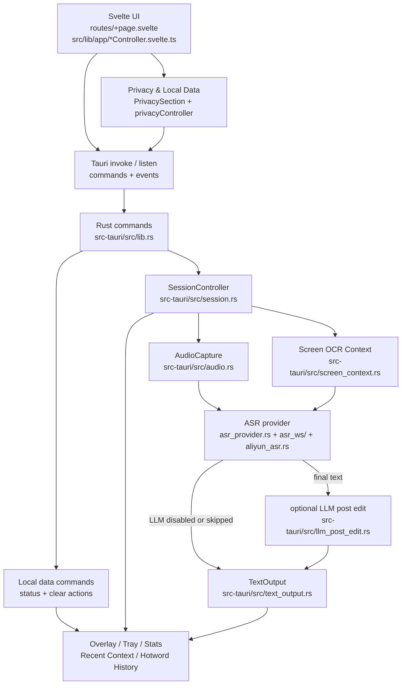

# VoxType 架构概览

本文说明 VoxType 的主要模块边界和数据流。目标是让维护者快速判断一次改动会影响哪些链路，而不是定义复杂的架构流程。

## 主链路



主窗口使用 Svelte 维护界面状态，通过 Tauri `invoke` 调用 Rust command，通过 `listen` 接收会话、字幕、统计、托盘和关闭提示事件。Rust 侧由 `SessionController` 统一管理录音会话状态，具体能力拆到音频、ASR、LLM、剪贴板输出、悬浮字幕、托盘、统计和上下文模块。

## 关键设计

### generation 防旧 worker 覆盖新会话

每次开始录音都会递增 `SessionController` 内部的 `generation`。ASR worker 启动时绑定当前 generation，后续状态更新、失败回写和成功结束都必须带着同一个 generation。若用户快速停止并开始下一轮，旧 worker 的迟到结果会被忽略，避免覆盖新会话状态、误显示成功或误恢复旧的处理阶段。

### 剪贴板恢复策略

`TextOutput` 只负责最终文本输出。默认流程是先按配置尝试快照原剪贴板，再写入识别文本，读回校验后发送 `Ctrl+V` 或 `Shift+Insert`，最后在安全延迟后恢复原剪贴板。无法安全快照的格式会跳过；恢复失败只记录 warning，不把已经成功粘贴的主流程改成失败。Win32 资源使用 `ClipboardGuard`、`OwnedGlobalMemory` 和 `LockedMemory` 收敛关闭、释放和解锁边界；`SetClipboardData` 成功后内存所有权转交系统剪贴板。

### 统计口径

统计文件只记录时间、耗时、字数和速度等非正文数据，不记录识别文本。节省时间统一按净节省计算：

```text
手打等效时间 - 实际语音时长
```

默认手打速度和语音速度只用于估算展示，最近 24 小时、最近 7 日和按日统计使用同一口径。

### 隐私边界

默认不得把真实密钥、识别正文、热词、prompt、最近上下文正文、屏幕 OCR 正文或 Windows 用户名路径写入日志、诊断报告、截图或文档。统计只保存非正文指标。最近上下文默认关闭；开启后写入独立本地文件，不写回 `config.toml`。自动热词历史默认关闭，只有开启后才保存 VoxType 自己生成的最终语音输入文本。主窗口提供“隐私与本地数据”页面，把保存位置、上传边界和本地清理动作前置给用户；该页只读取计数和开关状态，不展示正文内容。

### 配置和本地文件

- 主配置：`config.toml`。开发时优先使用项目根目录；安装版通常使用可执行文件附近的 `config.toml`。
- 统计文件：`voice_input_stats.jsonl`，路径解析逻辑与配置类似。
- 最近上下文：`context/recent_context.jsonl`，位于 `config.toml` 同级目录下的 `context/`。
- 自动热词历史：`context/hotword_history.jsonl`，同样位于配置目录下的 `context/`。
- 示例配置：`config.example.toml`，只能放占位值。

路径解析会优先寻找已存在文件，再回退到项目根目录或可执行文件目录，方便开发版和安装版复用同一套逻辑。
`get_local_data_status` 只汇总最近上下文条数、自动热词历史条数、统计记录数和相关开关；`clear_recent_context`、`clear_hotword_history` 与 `clear_usage_stats` 分别清理本地正文历史和非正文统计。

## ASR / LLM / OCR 数据流

ASR 质量与延迟相关改动必须同时参考 [ASR 质量与延迟守门清单](asr-quality-latency-guardrails.md)。该清单记录 0.1.102 后实测有效的参数组合、不可回退点、测试和手工回归建议。

1. 开始录音时，`SessionController` 加载配置，启动麦克风采集，并按需启动屏幕 OCR。
2. `screen_context.rs` 按配置截取当前显示器或当前前台窗口，在独立线程中执行，早于麦克风启动发起。OCR 等待与 ASR 建连并行：握手不依赖 OCR，只有首包 payload 依赖，`PendingScreenContext` 解析一次后由 ASR 首包和 LLM 润色共用。上下文只在本轮请求内使用，失败或超时会跳过，不阻断录音、最终识别和粘贴。
3. `asr_provider.rs` 按 `asr.provider` 选择豆包 ASR 或阿里云 FunASR，并做当前服务的启动前配置检查。
4. 豆包模式由 `asr.rs` 组装请求、`asr_ws/` 维护流式 WebSocket 会话、音频发送、最终文本选择和错误映射；阿里云模式由 `aliyun_asr.rs` 维护 `run-task`、音频上传、`finish-task` 和 `task-finished` 门禁。热词、最近上下文、场景上下文和 OCR 结果会按服务能力作为上下文发送；OCR 会标注为开始录音时的屏幕 OCR 上下文，不是用户指令或待识别文本。
5. 实时片段只用于悬浮字幕，最终结果进入后处理。豆包必须等待最终包，阿里云必须等待 `task-finished`；缺少最终结果时进入失败态。
6. `llm_post_edit.rs` 只在 LLM 已启用、润色触发长度达到 `min_chars` 且 Base URL、API Key、模型名完整时调用；中文按单字计，英文和数字按连续词片段计。用户词典、场景与偏好上下文、可选最近上下文和屏幕 OCR 会作为参考信息分区追加，并明确不是待润色文本或指令来源，也不能把待润色文本没说的参考信息补进输出。最近上下文进入 LLM 需要 `context.enable_recent_context` 和 `llm_post_edit.use_recent_context` 同时开启，并限制为最近几段中的约 600 字；默认提示词会保持待润色文本的主要语言，不主动翻译中文或外语内容；否则直接使用 ASR 最终文本。
7. `text_output.rs` 输出最终文本。空识别必须进入失败态，不触发 LLM、粘贴或成功统计。
8. 成功输出后，统计刷新、最近上下文和自动热词历史按配置更新；这些文件仍受隐私边界限制。

## 维护建议

- 新增 UI 状态优先放到 `src/lib/app/*Controller.svelte.ts`，让 `VoxTypeController.svelte.ts` 继续作为组合入口。
- 改主链路时先判断是否影响 ASR、LLM、剪贴板、统计、日志脱敏、热键或托盘，并同步 README、Wiki 或本文件中对应说明。
- 改配置字段时同步 Rust 默认值、配置模板、前端设置项、三语言文案和文档。
- 日常小改和发布前检查可以参考 [维护指南](maintenance-guide.md)，避免把 provider、设置页、隐私和发布规则散落在审计记录里。
